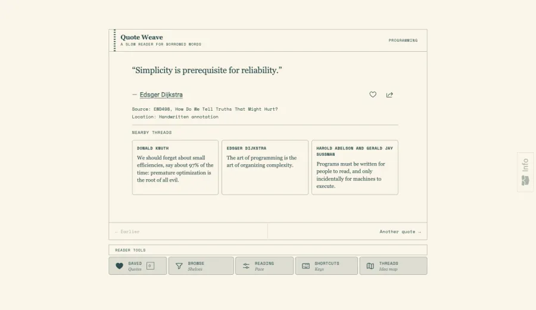
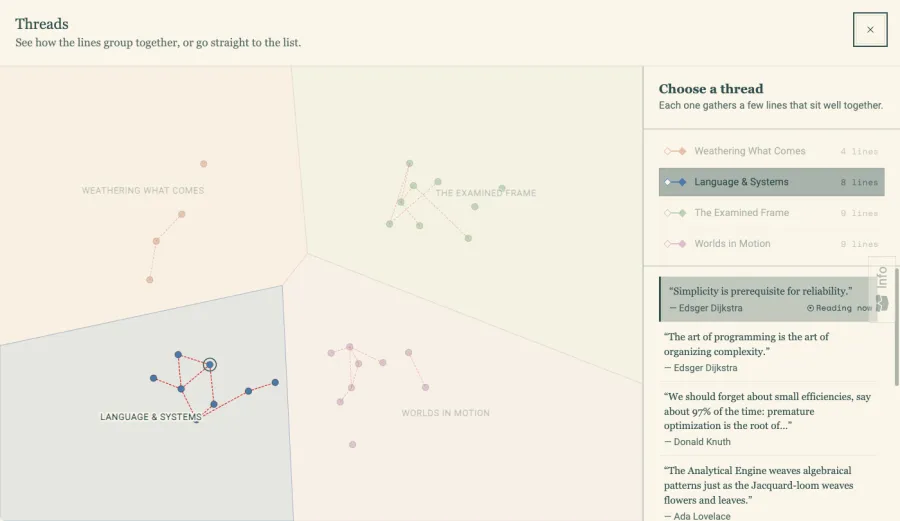

# Quote Weave



A small reading space for sourced quotations. Move between a quote, its nearby ideas, and its original source at your own pace.

Originally part of [edconde.com](https://edconde.com); this repository keeps the reader and its data together as a standalone app.

The threads view groups nearby ideas without interrupting the reader:



## Run locally

```sh
npm ci
npm start
```

`npm run typecheck`, `npm run test:ci`, and `npm run build` cover the production code, reader behavior, and build. The app is an Angular 21 static site. Favorites and reading preferences stay in browser storage. Author summaries load from Wikipedia when requested.

The 30-item quote corpus lives in `src/assets/data/quotes.json`. Each entry records its attribution status and source; `quote-map.json` supplies related quotes. The reader does not generate or rewrite quotations. `npm run check:data` validates the corpus and map. The optional map generator in `scripts/quote-map-tooling` has its own lockfile, so its model dependencies are absent from normal app installs.

## License

Application code is [MIT licensed](LICENSE). Quoted text and linked source material belong to their respective authors and publishers and are not covered by the code license. Bundled font licenses are included beside the font files in `public/assets/fonts`. Inline icon paths are covered by the [Phosphor Icons license](third_party/PHOSPHOR-LICENSE).
